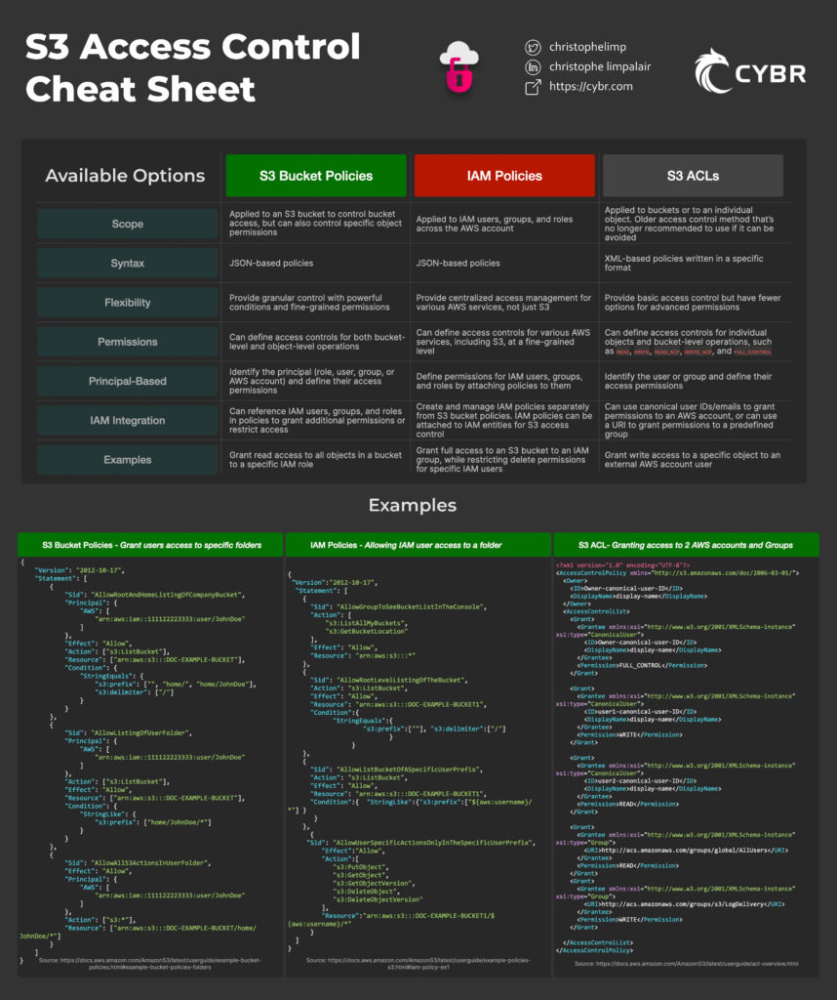

# Configure your AWS CLI

This step is so you have the authorization to create an S3 bucket in your AWS account from the command line.

```bash
aws configure
```

It will then ask for some credentials:

```bash

AWS Access Key ID: [ENTER YOUR ACCESS KEY]
AWS Secret Access Key: [ENTER YOUR SECRET ACCESS KEY]
Default region name: [ENTER YOUR PREFERRED REGION NAME]
Default output format: json

```

## Create your S3 bucket

On the command line:

```bash
aws s3api create-bucket --bucket yourdomain.com --region eu-west-1 --create-bucket-configuration LocationConstraint=eu-west-1
```

Note that we’ve named the bucket after the domain name we want to use. Replace ‘yourdomain.com’ with whatever domain you want to have your app at. Also, replace ‘eu-west-1’ with your own preferred region.

## Enable S3 bucket static website hosting
On the command line:

```bash
aws s3 website s3://yourdomain.com/ --index-document index.html --error-document index.html
```
Note that here we are also setting the index and error documents of our S3 static hosting bucket. For this example we have set them both to the NUXT index page (index.html) but in the future you may want to change the --error-document to an actual error page.


## Enable S3 bucket versioning
On the command line:

```bash
aws s3api put-bucket-versioning --bucket yourdomain.com --versioning-configuration Status=Enabled

```
## Create an S3 Policy to upload to S3 bucket
This allows your S3 bucket to be accessed via a public URL.

In your local directory create a JSON file called policy.json and add the following:

```json
{
  "Statement": [
    {
      "Effect": "Allow",
      "Principal": "*",
      "Action": "s3:GetObject",
      "Resource": "arn:aws:s3:::yourdomain.com/*"
    }
  ]
}
```

Then add the policy to your bucket from the command line:

```bash
aws s3api put-bucket-policy --bucket yourdomain.com --policy file://policy.json
```



### AWS S3: Bucket Policy vs. Access Control List (ACL)

Securing the objects stored in Amazon S3 (Simple Storage Service) is crucial for protecting sensitive data. When it comes to implementing access control, there are two commonly used methods: Bucket Policies and Access Control Lists (ACLs). These mechanisms allow administrators to define fine-grained permissions for their S3 buckets and the objects within. In this blog post, we will explore the differences between Bucket Policies and ACLs, how they function, and when it’s appropriate to use each.

